# RSSS Simulation 模块技术文档 v2.0

**模块** : `rsss::simulation`
**依赖** : `domain`, `engine`, `scripting`, `rhai`, `rand`, `rand_xoshiro`, `rayon`
**定位** : 系统的 **"上帝"** — 初始化世界、驱动时间、串联撮合与结算、管理 Agent 生命周期

---

## 1. 架构总览

```mermaid
graph TB
    subgraph "World::run_tick()"
        P1["Phase 1: Pre-Calc<br/>指标更新 + MarketState 构建"]
        P2["Phase 2: Decision<br/>Rayon 并行 Agent on_tick"]
        P3["Phase 3: Collect<br/>收集 ActionMailbox"]
        P4["Phase 4: Shuffle<br/>Fisher-Yates 确定性洗牌"]
        P5["Phase 5: Execution<br/>校验 → 撮合 → 结算"]
        P6["Phase 6: Maintenance<br/>GC 幽灵订单"]
        P1 --> P2 --> P3 --> P4 --> P5 --> P6
    end

    subgraph "数据流"
        IND["IndicatorEngine"] -->|MA/RSI/VWAP| MS["Arc<MarketState>"]
        OB["OrderBook"] -->|L2 快照| MS
        MS -->|只读注入| AG["Agent Scope"]
        AG -->|ActionMailbox| ACT["Vec<AgentAction>"]
        ACT -->|convert_action| ORD["engine::Order"]
        ORD -->|process_order| EV["Vec<MatchEvent>"]
        EV -->|settle_trade| SET["cash/stock/pnl"]
        EV -->|update_order_books| AOB["AgentOrderBook"]
    end
```



## 2. 文件结构与职责

```
src/simulation.rs                     模块根 + 扁平导出 (SimConfig, World)
src/simulation/
├── config.rs         45 行          SimConfig 参数 + Default
├── agent.rs         122 行          AgentState 生命周期管理
├── settlement.rs    394 行          前置校验 + 结算 + 订单跟踪更新
├── indicators.rs    297 行          增量技术指标引擎
├── world.rs         398 行          World 全局状态 + 6 阶段主循环
└── tests.rs         175 行          6 个集成测试
                    ─────
                    1431 行 总计
```

---

## 3. 核心数据结构

### 3.1 SimConfig

仿真的全部可控参数，通过 `Default` 提供合理默认值。

| 字段             | 类型    | 默认值           | 说明                          |
| :--------------- | :------ | :--------------- | :---------------------------- |
| `total_ticks`    | `i64`   | `10,000`         | 总仿真轮数                    |
| `warmup_ticks`   | `i64`   | `100`            | 预热期 (不执行交易)           |
| `initial_price`  | `i64`   | `100,000,000`    | 初始价 = 100.00 元 (微元)     |
| `global_seed`    | `u64`   | `42`             | 全局随机种子 (决定性基础)     |
| `num_agents`     | `u32`   | `1,000`          | Agent 数量                    |
| `initial_cash`   | `i64`   | `10,000,000,000` | 每 Agent 初始现金 = 10,000 元 |
| `initial_stock`  | `i64`   | `100`            | 每 Agent 初始持股             |
| `fee_rate_bps`   | `i64`   | `3`              | 手续费 = 万分之三 (双边)      |
| `gc_interval`    | `i64`   | `500`            | GC 检查间隔 (每 N Tick)       |
| `gc_threshold`   | `usize` | `10,000`         | 触发 GC 的幽灵阈值            |
| `history_window` | `usize` | `256`            | 指标滑动窗口大小              |

### 3.2 AgentState

每个 Agent 的完整运行时状态，唯一拥有自己的 `Scope` 和 `AgentOrderBook`。

```
AgentState
├── id: u32                      全局唯一标识
├── cash: i64                    当前现金 (微元)
├── stock: i64                   当前持股 (股)
├── total_cost: i64              累计买入成本 (微元) → 均价 = total_cost / stock
├── realized_pnl: i64            已实现盈亏 (微元)
├── ast: Arc<AST>                编译后的 Rhai 脚本 (多 Agent 可共享)
├── scope: Scope<'static>       私有 Scope (变量跨 Tick 保留)
├── rng: AgentRng                确定性 RNG (Xoshiro256++)
├── initialized: bool            是否已执行顶层初始化代码
└── order_book: AgentOrderBook   订单跟踪 (pending/fills/history)
```

**关键方法**：

| 方法                                        | 功能                                                 |
| :------------------------------------------ | :--------------------------------------------------- |
| `new(id, ast, seed, cash, stock)`           | 构建初始 Agent                                       |
| `avg_cost()` → `i64`                        | 持仓均价 = `total_cost / stock`，空仓返回 0          |
| `build_account_view(price)` → `AccountView` | 构建只读账户快照 (含 unrealized_pnl)                 |
| `run_tick(engine, market)`                  | 注入数据 → 首次执行 init → 执行 `on_tick` → 回收 RNG |
| `take_actions()` → `Vec<AgentAction>`       | 从 Scope 提取本 Tick 的决策                          |

### 3.3 World

全局仿真状态，串联所有组件。

```
World
├── config: SimConfig
├── tick: i64                            当前 Tick
├── rhai_engine: rhai::Engine            全局 Rhai 引擎 (Send + Sync)
├── order_book: OrderBook                撮合引擎
├── agents: Vec<AgentState>              全部 Agent
├── global_rng: Xoshiro256PlusPlus       全局 RNG (Fisher-Yates Shuffle 用)
├── indicators: IndicatorEngine          技术指标引擎
├── tick_volume / buy / sell: i64        Tick 级成交量聚合
├── tick_vwap_numer: i128                VWAP 分子 (i128 防溢出)
└── sim_rejects: u64                     前置校验拒绝计数
```

**关键方法**：

| 方法                          | 功能                               |
| :---------------------------- | :--------------------------------- |
| `World::new(config, scripts)` | 编译脚本 + 创建 Agent + 初始化引擎 |
| `run()`                       | 执行 `total_ticks` 个 Tick         |
| `run_tick()`                  | 执行单个 Tick (6 阶段, 见 §4)      |
| `process_event(event, ...)`   | 处理 MatchEvent → 结算 + 更新      |
| `build_market_state()`        | L2 快照 + 指标 → `MarketState`     |

---

## 4. 六阶段 Tick 循环

### Phase 1 — Pre-Calculation (主线程)

```
1a. 清空所有 Agent 的 last_fills
1b. 推送上 Tick 数据到 IndicatorEngine (MA/RSI/ATR 增量更新)
1c. 构建 Arc<MarketState> (L2 快照 + 12 项指标 + 历史窗口)
1d. 重置 Tick 级聚合 (volume/buy_volume/sell_volume/vwap_numer)
```

### Phase 2 — Agent Decision (Rayon 并行)

```rust
self.agents.par_iter_mut().for_each(|agent| {
    agent.run_tick(engine_ref, Arc::clone(&market));
});
```

每个 Agent 的 `run_tick` 内部：
1. `build_account_view(market.price)` → `AccountView`
2. 注入 `market`、`account`、`my_orders`、`orders` 到 Scope
3. 首次调用: `engine.run_ast_with_scope()` 执行顶层代码 + push `rng`
4. `engine.call_fn("on_tick")` 执行策略
5. 回收 `rng` 状态

> **并行安全**：每个 Agent 拥有独立的 `&mut AgentState`，Rayon 分片互不干扰。
> `market` 通过 `Arc` 共享只读。`rhai::Engine` 是 `Send + Sync`，共享 `&Engine` 即可。

### Phase 3 — Collect Actions (主线程)

```
遍历 agents → take_actions() → 拼接为 Vec<(u32, AgentAction)>
```

### Phase 4 — Deterministic Shuffle (主线程)

```rust
all_actions.shuffle(&mut self.global_rng);  // Fisher-Yates + Xoshiro256++
```

> `global_rng` 由 `global_seed` 初始化 → 相同种子 → 相同 Shuffle 顺序 → 相同撮合结果。

### Phase 5 — Execution + Settlement (主线程, 严格串行)

```
for (agent_id, action) in all_actions:
    if !trading_enabled:  continue     ← 预热期跳过

    if validate_action(agent, action).is_err():
        record_sim_rejection(...)      ← 记入 history (status=2)
        sim_rejects += 1
        continue

    match action:
        Cancel → order_book.cancel_order(id)
        _      → convert_action → order_book.process_order(order)

    for event in match_events:
        process_event(event)           ← 结算 + 更新 OrderBook + 聚合统计
```

### Phase 6 — Maintenance

```
每 gc_interval 个 Tick 检查 phantom_count()
超过 gc_threshold → gc_phantom_orders()
```

---

## 5. 结算系统 (settlement.rs)

### 5.1 订单前置校验

在 `process_order` 之前拦截非法订单，**不进入撮合引擎**。

| 条件                    | 适用类型 | 拒绝原因            |
| :---------------------- | :------- | :------------------ |
| `amount ≤ 0`            | 所有     | `ZeroAmount`        |
| `price ≤ 0`             | 限价单   | `InvalidPrice`      |
| `stock < amount`        | 卖出     | `InsufficientStock` |
| `cash < price × amount` | 限价买   | `InsufficientCash`  |
| `cash ≤ 0`              | 市价买   | `InsufficientCash`  |

- 限价买使用 `i128` 计算 `price × amount` 防溢出
- 市价买仅检查 `cash > 0` (无法预知成交价)
- 被拒订单记入 `AgentOrderBook.history`，`status = 2`

### 5.2 Trade 结算

`settle_trade()` 处理一笔撮合成交：

```
                  Taker = Bid (买入)          Taker = Ask (卖出)
Taker:   cash -= cost + fee, stock += vol   cash += cost - fee, stock -= vol
Maker:   cash += cost - fee, stock -= vol   cash -= cost + fee, stock += vol
```

- **双边手续费**：Maker 和 Taker 各付 `fee = cost × fee_rate_bps / 10000`
- **已实现盈亏**：卖方计算 `realized_pnl += (trade_price - avg_cost) × vol`
- **成本跟踪**：卖出后 `total_cost -= avg_cost × vol`；买入后 `total_cost += cost`
- **溢出安全**：`calculate_cost()` 内部提升 `i128` 做乘法

### 5.3 AgentOrderBook 更新

四种 `MatchEvent` 分别由独立函数处理：

| 函数                           | 事件        | 操作                                                                  |
| :----------------------------- | :---------- | :-------------------------------------------------------------------- |
| `update_order_books_trade`     | `Trade`     | Maker: pending 减 remaining → 完全成交移入 history；双方加 FillReport |
| `update_order_books_placed`    | `Placed`    | Taker: 加入 pending                                                   |
| `update_order_books_cancelled` | `Cancelled` | 从 order_id 反查 owner → pending 移入 history (status=1)              |
| `update_order_books_rejected`  | `Rejected`  | 记入 history (status=2)                                               |
| `record_sim_rejection`         | Sim 层拒绝  | 记入 history (status=2)                                               |

**Owner 反查**：利用 `order_id = (agent_id << 32) | counter`，通过 `(order_id >> 32) as u32` 还原。

---

## 6. 技术指标引擎 (indicators.rs)

`IndicatorEngine` 维护滑动窗口 (`VecDeque`) + 增量累加器，每次 `push()` 仅 O(1) 更新。

### 6.1 指标清单

| 指标         | 方法           | 算法                            | 精度              |
| :----------- | :------------- | :------------------------------ | :---------------- |
| 最新价格     | `last_price()` | 最后一笔成交价                  | 微元 (i64)        |
| MA-5         | `ma_5()`       | 增量累加器 `sum_5`              | 微元              |
| MA-20        | `ma_20()`      | 增量累加器 `sum_20`             | 微元              |
| MA-60        | `ma_60()`      | 增量累加器 `sum_60`             | 微元              |
| 20-Tick High | `high_20()`    | 窗口遍历                        | 微元              |
| 20-Tick Low  | `low_20()`     | 窗口遍历                        | 微元              |
| VWAP         | `vwap()`       | `Σ(p×v) / Σv`，`i128` 分子      | 微元              |
| Std Dev (20) | `std_dev()`    | 窗口方差 → Newton's isqrt       | 微元              |
| RSI-14       | `rsi_14()`     | 指数移动平均 `(prev×13+new)/14` | ×100 → [0, 10000] |
| ATR-14       | `atr_14()`     | EMA of True Range               | 微元              |
| 历史价格     | `prices`       | `VecDeque<i64>`                 | 微元              |
| 历史成交量   | `volumes`      | `VecDeque<i64>`                 | 股                |

### 6.2 RSI 计算细节

```
前 14 期: 累加 gain/loss → rsi_count == 14 时取简单平均
之后每期: avg_gain = (avg_gain × 13 + gain) / 14  (EMA 平滑)
RSI = avg_gain / (avg_gain + avg_loss) × 10000
```

### 6.3 ATR 计算

```
True Range ≈ |price - prev_price|  (单 Tick 近似)
前 14 期: 累加 → 简单平均
之后: EMA = (prev × 13 + tr) / 14
```

---

## 7. AgentAction → engine::Order 转换

`convert_action()` 将 scripting 层的 `i64` 类型桥接到 engine 层的 `Price/Vol/u64`：

| AgentAction                            | → Order                                                                                         |
| :------------------------------------- | :---------------------------------------------------------------------------------------------- |
| `LimitBuy { order_id, price, amount }` | `Order { id: as u64, price: Price(price), amount: Vol(amount as u64), side: Bid, kind: Limit }` |
| `LimitSell { ... }`                    | 同上，`side: Ask`                                                                               |
| `MarketBuy { order_id, amount }`       | `price: Price(i64::MAX)`，`kind: Market`                                                        |
| `MarketSell { order_id, amount }`      | `price: Price(0)`，`kind: Market`                                                               |
| `Cancel { order_id }`                  | 不转换，走 `cancel_order` 路径                                                                  |

---

## 8. MarketState 构建

`build_market_state()` 每 Tick Phase 1 调用一次，聚合所有数据：

| 数据源                         | MarketState 字段                                                                                            |
| :----------------------------- | :---------------------------------------------------------------------------------------------------------- |
| `IndicatorEngine`              | `price`, `ma_5/20/60`, `high_20`, `low_20`, `vwap`, `std_dev`, `atr_14`, `rsi_14`, `history_prices/volumes` |
| `OrderBook.get_l2_snapshot(5)` | `bid_prices[5]`, `bid_volumes[5]`, `ask_prices[5]`, `ask_volumes[5]`                                        |
| 计算得出                       | `order_imbalance = (bid_total - ask_total) × 10000 / (bid_total + ask_total)`                               |
| `SimConfig`                    | `total_ticks`, `fee_rate_bps`, `trading_enabled`                                                            |
| `World`                        | `tick`, `tick_volume`, `tick_buy_volume`, `tick_sell_volume`                                                |

最终包装为 `Arc<MarketState>` 后通过 `Arc::clone` 零拷贝分发给所有 Agent。

---

## 9. 预热期 (Warm-Up)

```
Tick 0 ... warmup_ticks-1:
  ✓ Agent 可观察市场 (market.trading_enabled == false)
  ✓ Agent 可执行 on_tick 初始化策略内部状态
  ✓ Agent 的 submit_* 调用仍被收集
  ✗ Execution 阶段跳过 → 不进入引擎 → 无 cash/stock 变动

Tick warmup_ticks ... total_ticks-1:
  ✓ trading_enabled = true
  ✓ 正常交易
```

---

## 10. 确定性保证

| 环节         | 机制                                                |
| :----------- | :-------------------------------------------------- |
| Agent RNG    | `seed = hash(global_seed, agent_id)` → Xoshiro256++ |
| Shuffle 顺序 | `global_rng` (Xoshiro256++) → Fisher-Yates          |
| 撮合顺序     | Phase 5 严格串行                                    |
| 指标计算     | 纯整数运算 (i64/i128)，无浮点                       |
| Rhai 执行    | `no_float` + `only_i64`，确定性 ops                 |

**验证方式**：`test_deterministic_runs` — 同种子运行两次 50 Ticks (含随机下单)，断言所有 Agent 的 `cash/stock/realized_pnl` 完全一致。

---

## 11. 性能特征

| 阶段                  | 复杂度       | 瓶颈                       |
| :-------------------- | :----------- | :------------------------- |
| Phase 1 (Pre-Calc)    | O(window)    | L2 snapshot + 指标         |
| Phase 2 (Decision)    | O(N/cores)   | Rhai 解释执行 (Rayon 并行) |
| Phase 3 (Collect)     | O(N)         | Vec 收集                   |
| Phase 4 (Shuffle)     | O(A)         | A = 总 action 数           |
| Phase 5 (Execution)   | O(A × log P) | P = 盘口档位数             |
| Phase 6 (Maintenance) | O(1) 或 O(U) | U = 幽灵订单数             |

1000 Agent, Rayon 8 核 → 预估 **~5 ms/tick**, **~200 tps**。

---

## 12. 公开 API

```rust
// 构建
pub fn World::new(config: SimConfig, scripts: Vec<String>) -> Result<World, String>;

// 运行
pub fn World::run(&mut self);        // 运行全部 Tick
pub fn World::run_tick(&mut self);   // 运行单个 Tick

// 查询
pub fn World::tick -> i64;
pub fn World::sim_rejects -> u64;
pub fn World::indicators -> &IndicatorEngine;
pub fn World::order_book -> &OrderBook;
pub fn World::agents -> &[AgentState];
```

---

## 13. 测试覆盖

| 测试                          | 验证内容                                         |
| :---------------------------- | :----------------------------------------------- |
| `test_world_builds`           | World 构建不 panic                               |
| `test_world_runs_empty_ticks` | 20 Tick 空运行不 panic                           |
| `test_agent_places_order`     | 买卖双方下单后有订单活动                         |
| `test_invalid_order_rejected` | 0 持股卖出 → `sim_rejects > 0`, history status=2 |
| `test_deterministic_runs`     | 同种子两次运行结果完全一致                       |
| `test_warmup_no_trades`       | 全预热期 → cash/stock 无变动                     |

settlement.rs 内另有 5 个单元测试：
- `test_validate_reject_zero_amount` / `insufficient_stock` / `insufficient_cash`
- `test_validate_accept`
- `test_settle_trade_buy` (验证结算金额精确到微元)

indicators.rs 内 3 个单元测试：
- `test_ma_basic` (MA5 = 102)
- `test_high_low` (High=105, Low=95)
- `test_vwap` (VWAP = 101.50)
